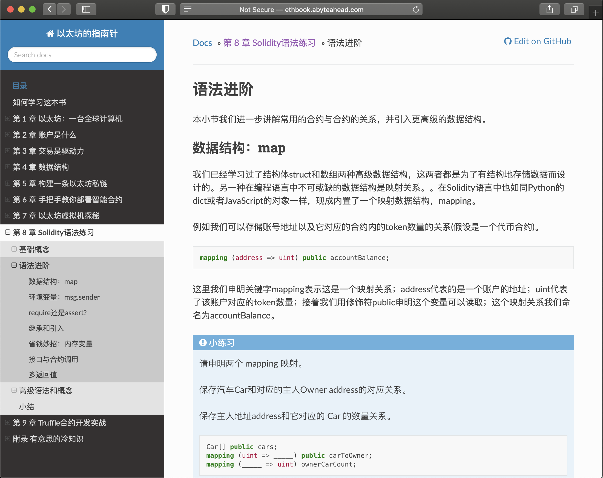

## [《以太坊的指南针》](http://ethbook.abyteahead.com/)

全书链接：http://ethbook.abyteahead.com/

这是给 **程序员** 读的入门书，更是一本面向 **从未接触过以太坊人群** 的书。

以太坊是什么？怎么了解以太坊的相关知识？

这本书涵盖了你想要了解的以太坊的基本知识，包括钱包、交易、数据结构。也包括了Solidity语法、虚拟机原理和实战合约编写。

市面上目前的大部分公链/联盟链都借鉴了以太坊的虚拟机。读完本书，你会感到成竹在胸。

书中的知识点都是作者在区块链工作中实践总结的。希望对你们有帮助。

鸣谢唯链核心开发组的队友们的指导。



## 目录
```
第 1 章 以太坊：一台全球计算机
  简史
  发展阶段
  以太坊的特色

第 2 章 账户是什么
  小白基础知识问答
  账户探秘
  扩展阅读
  资料篇：Keystore 与私钥保存
  资料篇：常用钱包 App
  资料篇：EIP-55 格式的账户地址

第 3 章 交易是驱动力
  交易的发送
  交易的样子
  交易的生命周期
  扩展阅读
  资料篇：共识与工作量证明
  资料篇：矿工与挖矿奖励

第 4 章 数据结构
  Radix树
  Merkle树和 Merkle证明
  Merkle Patricia树
  RLP编码
  扩展阅读
  资料篇：状态树 (以及存储树）
  资料篇：交易树
  资料篇：收据树
  资料篇：区块

第 5 章 构建一条以太坊私链
   安装
   Geth客户端的结构
   启动一条以太坊私链
   接收挖矿奖励
   转账与收款

第 6 章 手把手教你部署智能合约
   什么是智能合约？
   安装编译器
   Solc编译智能合约
   智能合约发布准备
   部署智能合约
   调用智能合约

第 7 章 以太坊虚拟机探秘
   虚拟机的执行结果
   虚拟机的执行资源
   合约调用合约?
   虚拟机的输入输出
   Gas 花费与退回
   虚拟机指令集

第 8 章 Solidity语法练习
   基础概念
   语法进阶
   高级语法和概念
   小结

第 9 章 Truffle合约开发实战
   编译、测试工具安装
   Truffle启动样例项目
   上手实践：ERC20合约
   上手实践：ERC20合约测试

附录 有意思的冷知识
   短地址攻击
   比特币的区块
   以太坊与比特币账户的区别
   “不可能的三角”问题
   ETHASH 挖矿算法
```

## 参与项目

如有改进意见，请直接在Issue页面提出。我们会及时修改。